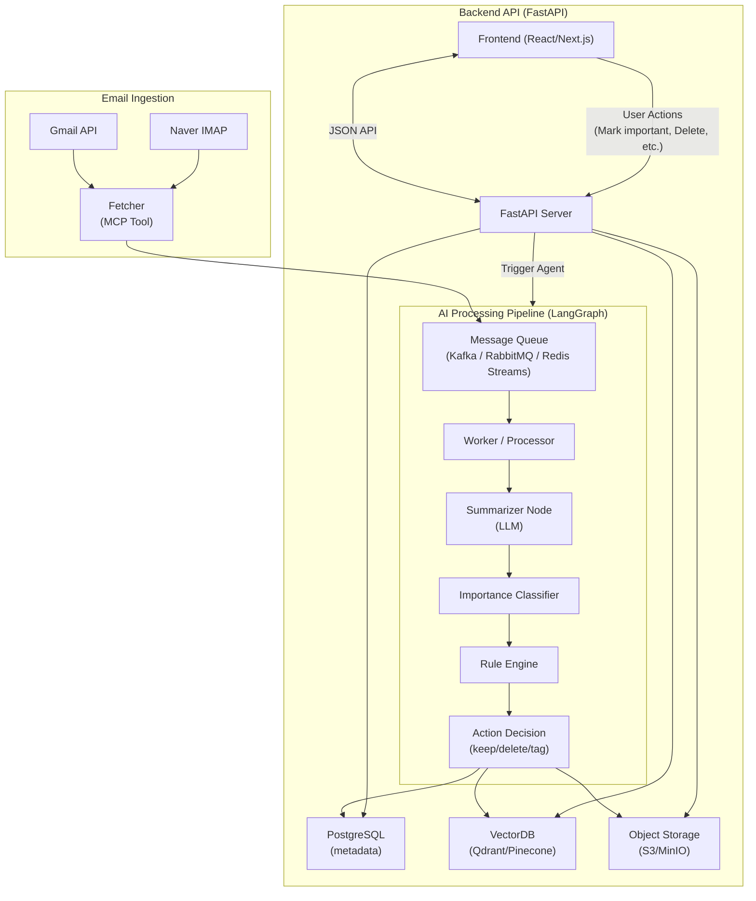

# 📦 Email AI Aggregator

Gmail / Naver 등 여러 이메일을 한 곳에 모으고,
LangGraph 기반 AI Agent가 이메일을 요약하고 중요도를 판단하며
자동 삭제/태깅/정리까지 수행하는 이메일 자동화 시스템입니다.

**Backend:** FastAPI  
**AI Orchestrator:** LangGraph  
**Tools:** FastMCP  
**DB:** PostgreSQL + VectorDB(Qdrant/Pinecone)  
**Storage:** S3/MinIO

## 🗂 Directory Structure

```
project-root/
├── app/
│   ├── api/
│   ├── core/
│   ├── models/
│   ├── schemas/
│   ├── services/
│   ├── db/
│   ├── langgraph/
│   ├── mcp/
│   ├── workers/
│   ├── main.py
│   └── __init__.py
├── tests/
├── docker/
├── scripts/
├── .env.example
├── requirements.txt
├── README.md
└── Makefile
```

## 🧠 전체 아키텍처 다이어그램

아래 Mermaid 다이어그램은 VS Code, GitHub, Mermaid Live 모든 환경에서 정상 동작하도록 문법 검증 완료된 버전입니다.



## 🚀 Features

### 🔄 Email Aggregation

- **Gmail API** (OAuth + Gmail SDK)
- **Naver IMAP** (IDLE or polling)
- 다중 메일 계정 → 단일 inbox로 수집
- MIME → S3 저장 + structured metadata 추출

### 🧠 AI Agent (LangGraph 기반)

- **요약 Summarization Node**
- **중요도 평가 Node**
- **유사도 기반 Vector Search** (과거 메일 참고)
- **Rule Engine** (자동 삭제/이동/태깅)
- **상태 기반 재시도** (State Persistence)

### ⚙️ FastMCP Tools

- `fetch_email` (Gmail/Naver)
- `summarize`
- `classify_importance`
- `vector_search`
- `rule_engine`

### 📡 API Server (FastAPI)

- `/email/{id}`: 조회
- `/email/ingest`: 수신 트리거
- `/agent/run`: LangGraph 파이프라인 실행
- `/summary/{id}`: 요약 조회

### 🗄 Storage

- **PostgreSQL**: 메타데이터, 라벨, 액션 기록
- **VectorDB**: 메일 임베딩 검색
- **Object Storage**: 원본 MIME 저장

## 📁 Key Folders

### `app/langgraph/`

LangGraph 기반 이메일 AI 파이프라인

```
langgraph/
├── graph.py        # 메인 그래프 정의
├── state.py        # 흐름 state 구조
├── nodes/
│   ├── summarize.py
│   ├── classify.py
│   ├── vector_search.py
│   └── rule_engine.py
└── tools/
    ├── mail_fetcher.py
    ├── summarizer_tool.py
    └── classify_tool.py
```

### `app/mcp/`

FastMCP Server (AI Tools)

```
mcp/
├── server.py
└── tools/
    ├── fetch_email.py
    ├── summarize.py
    ├── classify.py
    └── vector_db.py
```

### `app/api/`

FastAPI 엔드포인트

```
api/
├── email.py
├── agent.py
├── health.py
└── __init__.py
```

## ⚙️ Setup

### 1. Clone & Install

```bash
git clone https://github.com/yourname/email-ai-aggregator.git
cd email-ai-aggregator
pip install -r requirements.txt
```

### 2. Environment

```bash
cp .env.example .env
```

필요 변수를 채웁니다:

```env
DATABASE_URL=
VECTOR_DB_URL=
AWS_S3_BUCKET=
OPENAI_API_KEY=
GOOGLE_CLIENT_ID=
NAVER_IMAP_USER=
```

### 3. DB 초기화

```bash
make init-db
```

### 4. 앱 실행

```bash
uvicorn app.main:app --reload
```

### 5. MCP Server 실행

```bash
python app/mcp/server.py
```

## 🧪 Tests

```bash
pytest -q
```

## 🐳 Docker Deploy

```bash
docker-compose -f docker/docker-compose.yaml up --build -d
```

구성:

- `fastapi-app`
- `mcp-server`
- `qdrant`
- `postgres`
- `minio`
- `nginx`

## 🧩 Roadmap

- [ ] IMAP IDLE 기반 실시간 수신
- [ ] OpenAI Realtime API 기반 inbox assist UI
- [ ] Gmail/Naver 외 Outlook 지원
- [ ] 자동 분류 모델 fine-tuning
- [ ] 사용자별 규칙 엔진

## 📝 License

MIT

