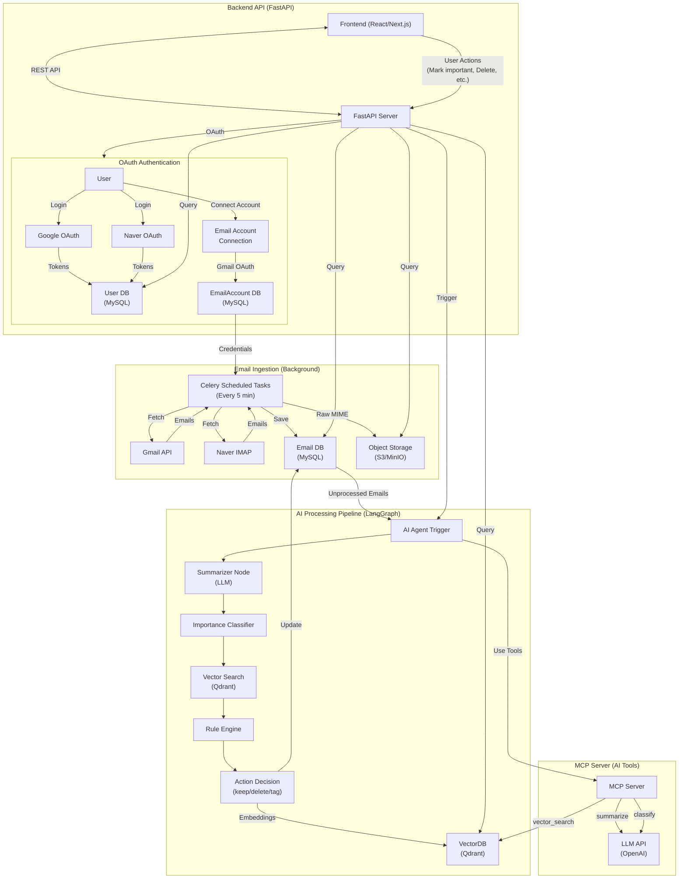

# 📦 Email AI Aggregator

Gmail / Naver 등 여러 이메일을 한 곳에 모으고,
LangGraph 기반 AI Agent가 이메일을 요약하고 중요도를 판단하며
자동 삭제/태깅/정리까지 수행하는 이메일 자동화 시스템입니다.

**Backend:** FastAPI  
**AI Orchestrator:** LangGraph  
**Tools:** FastMCP  
**DB:** MySQL + VectorDB(Qdrant/Pinecone)  
**Storage:** S3/MinIO  
**Task Queue:** Celery + Redis  
**Logging:** Loguru

## 🗂 Directory Structure

```
project-root/
├── app/
│   ├── api/
│   │   ├── auth.py
│   │   ├── email.py
│   │   ├── agent.py
│   │   └── health.py
│   ├── core/
│   │   ├── config.py
│   │   ├── logging.py
│   │   ├── celery_app.py
│   │   └── security.py
│   ├── models/
│   │   ├── user.py
│   │   ├── email_account.py
│   │   ├── email.py
│   │   └── agent.py
│   ├── schemas/
│   │   ├── email_schema.py
│   │   └── agent_schema.py
│   ├── services/
│   │   ├── auth_service.py
│   │   ├── email_account_service.py
│   │   ├── email_service.py
│   │   ├── agent_service.py
│   │   └── summarizer_service.py
│   ├── db/
│   │   ├── session.py
│   │   └── repositories/
│   │       ├── email_repo.py
│   │       └── user_repo.py
│   ├── langgraph/
│   │   ├── graph.py
│   │   ├── state.py
│   │   ├── nodes/
│   │   │   ├── summarize.py
│   │   │   ├── classify.py
│   │   │   ├── vector_search.py
│   │   │   └── rule_engine.py
│   │   └── tools/
│   │       ├── mail_fetcher.py
│   │       └── vector_db_tool.py
│   ├── mcp/
│   │   ├── server.py
│   │   └── tools/
│   │       ├── fetch_email.py
│   │       ├── summarize.py
│   │       ├── classify.py
│   │       └── providers/
│   │           ├── base.py
│   │           ├── gmail.py
│   │           ├── naver.py
│   │           └── factory.py
│   ├── tasks/
│   │   ├── email_tasks.py
│   │   └── providers/
│   │       ├── base.py
│   │       ├── gmail.py
│   │       ├── naver.py
│   │       └── factory.py
│   ├── workers/
│   │   ├── email_worker.py
│   │   └── queue_consumer.py
│   ├── main.py
│   └── __init__.py
├── tests/
│   ├── api/
│   ├── langgraph/
│   └── services/
├── docs/
│   ├── database_relationships.md
│   ├── oauth_flow.md
│   └── server_architecture.md
├── docker/
│   ├── Dockerfile.app
│   ├── Dockerfile.mcp
│   ├── docker-compose.yaml
│   └── nginx.conf
├── scripts/
│   ├── init_db.py
│   ├── load_test_data.py
│   └── benchmark_agent.py
├── .env.example
├── requirements.txt
├── README.md
└── Makefile
```

## 🧠 전체 아키텍처 다이어그램

아래 Mermaid 다이어그램은 VS Code, GitHub, Mermaid Live 모든 환경에서 정상 동작하도록 문법 검증 완료된 버전입니다.



## 🚀 Features

### 🔄 Email Aggregation

- **Gmail API** (OAuth + Gmail SDK)
- **Naver IMAP** (IDLE or polling)
- **Celery Scheduled Tasks**: Background에서 주기적으로 이메일 수집 (기본 5분마다)
- 다중 메일 계정 → 단일 inbox로 수집
- MIME → S3/MinIO 저장 + structured metadata 추출
- MySQL에 메타데이터 저장

### 🧠 AI Agent (LangGraph 기반)

- **요약 Summarization Node**
- **중요도 평가 Node**
- **유사도 기반 Vector Search** (과거 메일 참고)
- **Rule Engine** (자동 삭제/이동/태깅)
- **상태 기반 재시도** (State Persistence)

### ⚙️ FastMCP Tools

- `fetch_email` (Gmail/Naver)
- `summarize`
- `classify_importance`
- `vector_search`
- `rule_engine`

### 📡 API Server (FastAPI)

**OAuth 인증:**
- `/api/auth/google/login`: Google 로그인
- `/api/auth/google/callback`: Google 로그인 콜백
- `/api/auth/naver/login`: Naver 로그인
- `/api/auth/email-accounts/gmail/connect`: Gmail 계정 연결

**이메일 API:**
- `/api/email/{id}`: 이메일 조회
- `/api/email/ingest`: 수신 트리거
- `/api/email/{id}/summary`: 요약 조회

**Agent API:**
- `/api/agent/run`: LangGraph 파이프라인 실행

**Health Check:**
- `/api/health`: 헬스 체크

### 🗄 Storage

- **MySQL**: 사용자, 이메일 계정, 이메일 메타데이터 저장
- **VectorDB (Qdrant)**: 메일 임베딩 검색
- **Object Storage (S3/MinIO)**: 원본 MIME 저장
- **Redis**: Celery broker 및 결과 저장

## 📁 Key Folders

### `app/langgraph/`

LangGraph 기반 이메일 AI 파이프라인

```
langgraph/
├── graph.py        # 메인 그래프 정의
├── state.py        # 흐름 state 구조
├── nodes/
│   ├── summarize.py
│   ├── classify.py
│   ├── vector_search.py
│   └── rule_engine.py
└── tools/
    ├── mail_fetcher.py
    ├── summarizer_tool.py
    └── classify_tool.py
```

### `app/mcp/`

FastMCP Server (AI Tools)

```
mcp/
├── server.py
└── tools/
    ├── fetch_email.py
    ├── summarize.py
    ├── classify.py
    ├── vector_db.py
    └── providers/
        ├── base.py
        ├── gmail.py
        ├── naver.py
        └── factory.py
```

### `app/api/`

FastAPI 엔드포인트

```
api/
├── auth.py          # OAuth 인증 엔드포인트
├── email.py         # 이메일 조회/수집 API
├── agent.py         # AI Agent 실행 API
├── health.py        # 헬스 체크
└── __init__.py
```

### `app/tasks/`

Celery Background Tasks

```
tasks/
├── email_tasks.py   # 이메일 수집 스케줄링 태스크
└── providers/       # 이메일 Provider 구현
    ├── base.py
    ├── gmail.py
    ├── naver.py
    └── factory.py
```

### `app/services/`

비즈니스 로직 서비스

```
services/
├── auth_service.py              # OAuth 인증 서비스
├── email_account_service.py     # 이메일 계정 연결 서비스
├── email_service.py             # 이메일 비즈니스 로직
├── agent_service.py                 # LangGraph 호출 Wrapper
└── summarizer_service.py       # 요약 서비스
```

### `app/models/`

데이터베이스 모델

```
models/
├── user.py           # User 모델 (OAuth)
├── email_account.py  # EmailAccount 모델
├── email.py          # Email 모델 (메타데이터)
└── agent.py          # Agent 관련 모델
```

## ⚙️ Setup

### 1. Clone & Install

```bash
git clone https://github.com/yourname/email-ai-aggregator.git
cd email-ai-aggregator
pip install -r requirements.txt
```

### 2. Environment

```bash
cp .env.example .env
```

필요 변수를 채웁니다:

```env
# Environment
ENVIRONMENT=dev
DEBUG=true

# Database - MySQL (Local Development)
DB_HOST=localhost
DB_PORT=3306
DB_USER=root
DB_PASSWORD=
DB_NAME=email_agent

# Celery
CELERY_BROKER_URL=redis://localhost:6379/0
CELERY_RESULT_BACKEND=redis://localhost:6379/0

# LLM
OPENAI_API_KEY=

# Email Providers
GOOGLE_CLIENT_ID=
GOOGLE_CLIENT_SECRET=
NAVER_IMAP_USER=
NAVER_IMAP_PASSWORD=
```

### 3. DB 초기화

**방법 1: Alembic 마이그레이션 사용 (권장)**
```bash
# 초기 마이그레이션 생성
alembic revision --autogenerate -m "Initial migration"

# 데이터베이스에 테이블 생성
alembic upgrade head
```

**방법 2: 스크립트 사용 (빠른 설정)**
```bash
make init-db
# 또는
python scripts/init_db.py
```

### 4. 앱 실행

**FastAPI 서버:**
```bash
uvicorn app.main:app --reload
```

**MCP Server (별도 터미널):**
```bash
python app/mcp/server.py
```

**Celery Worker (별도 터미널):**
```bash
celery -A app.workers.email_worker worker --loglevel=info
```

**Celery Beat (별도 터미널, 스케줄링):**
```bash
celery -A app.workers.email_worker beat --loglevel=info
```

## 🧪 Tests

```bash
pytest -q
```

## 🐳 Docker Deploy

```bash
docker-compose -f docker/docker-compose.yaml up --build -d
```

구성:

- `fastapi-app` - FastAPI 서버
- `mcp-server` - MCP 서버 (AI Tools)
- `celery-worker` - Celery 워커 (이메일 수집)
- `celery-beat` - Celery Beat (스케줄링)
- `mysql` - MySQL 데이터베이스
- `qdrant` - VectorDB
- `redis` - Celery broker
- `minio` - Object Storage
- `nginx` - 리버스 프록시

## 🧩 Roadmap

- [ ] IMAP IDLE 기반 실시간 수신
- [ ] OpenAI Realtime API 기반 inbox assist UI
- [ ] Gmail/Naver 외 Outlook 지원
- [ ] 자동 분류 모델 fine-tuning
- [ ] 사용자별 규칙 엔진

## 📝 License

MIT

