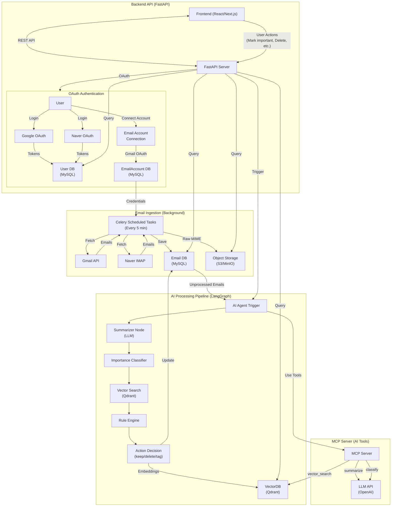

# 📦 Email AI Aggregator

Gmail / Naver 등 여러 이메일을 한 곳에 모으고,
LangGraph 기반 AI Agent가 이메일을 요약하고 중요도를 판단하며
자동 삭제/태깅/정리까지 수행하는 이메일 자동화 시스템입니다.

**Backend:** FastAPI  
**AI Orchestrator:** LangGraph  
**Tools:** FastMCP  
**DB:** MySQL + VectorDB(Qdrant/Pinecone)  
**Storage:** S3/MinIO  
**Task Queue:** Celery + Redis  
**Logging:** Loguru

## 🗂 Directory Structure

```
project-root/
├── app/
│   ├── api/
│   │   ├── auth.py
│   │   ├── email.py
│   │   ├── agent.py
│   │   └── health.py
│   ├── core/
│   │   ├── config.py
│   │   ├── logging.py
│   │   ├── celery_app.py
│   │   ├── security.py
│   │   └── id_encryption.py
│   ├── models/
│   │   ├── user.py
│   │   ├── email_account.py
│   │   ├── email.py
│   │   └── agent.py
│   ├── schemas/
│   │   ├── email_schema.py
│   │   └── agent_schema.py
│   ├── services/
│   │   ├── auth_service.py
│   │   ├── email_account_service.py
│   │   ├── email_service.py
│   │   ├── agent_service.py
│   │   └── summarizer_service.py
│   ├── db/
│   │   ├── session.py
│   │   └── repositories/
│   │       ├── email_repo.py
│   │       ├── email_account_repo.py
│   │       └── user_repo.py
│   ├── langgraph/
│   │   ├── graph.py
│   │   ├── state.py
│   │   ├── nodes/
│   │   │   ├── summarize.py
│   │   │   ├── classify.py
│   │   │   ├── vector_search.py
│   │   │   └── rule_engine.py
│   │   └── tools/
│   │       ├── mail_fetcher.py
│   │       └── vector_db_tool.py
│   ├── mcp/
│   │   ├── server.py
│   │   └── tools/
│   │       ├── fetch_email.py
│   │       ├── summarize.py
│   │       ├── classify.py
│   │       └── providers/
│   │           ├── base.py
│   │           ├── gmail.py
│   │           ├── naver.py
│   │           └── factory.py
│   ├── tasks/
│   │   ├── email_tasks.py
│   │   ├── utils.py
│   │   └── providers/
│   │       ├── base.py
│   │       ├── gmail.py
│   │       ├── naver.py
│   │       └── factory.py
│   ├── workers/
│   │   ├── email_worker.py
│   │   └── queue_consumer.py
│   ├── main.py
│   └── __init__.py
├── tests/
│   ├── api/
│   ├── langgraph/
│   └── services/
├── docs/
│   ├── alembic_usage.md
│   ├── celery_beat_setup.md
│   ├── database_relationships.md
│   ├── database_setup.md
│   ├── email_processing_workflow.md
│   ├── execution_checklist.md
│   ├── gmail_account_setup.md
│   ├── google_oauth_setup.md
│   ├── idor_protection.md
│   ├── oauth_flow.md
│   ├── security_audit.md
│   ├── server_architecture.md
│   ├── test_email_fetch.md
│   ├── minio_setup.md
│   └── storage_structure.md
├── docker/
│   ├── Dockerfile.app
│   ├── Dockerfile.worker
│   ├── Dockerfile.beat
│   ├── docker-compose.yaml
│   ├── nginx.conf
│   └── .dockerignore
├── scripts/
│   ├── init_db.py
│   ├── load_test_data.py
│   └── benchmark_agent.py
├── alembic.ini
├── alembic/
│   ├── env.py
│   ├── script.py.mako
│   └── versions/
├── .env.sample
├── requirements.txt
├── README.md
└── Makefile
```

## 🧠 전체 아키텍처 다이어그램

아래 Mermaid 다이어그램은 VS Code, GitHub, Mermaid Live 모든 환경에서 정상 동작하도록 문법 검증 완료된 버전입니다.



## 🚀 Features

### 🔄 Email Aggregation

- **Gmail API** (OAuth + Gmail SDK) ✅ 구현 완료
- **Naver IMAP** (IMAP credentials) ✅ 구현 완료
- **Celery Scheduled Tasks**: Background에서 주기적으로 이메일 수집 (기본 5분마다) ✅ 구현 완료
- 다중 메일 계정 → 단일 inbox로 수집 ✅ 구현 완료
- Attachment 인식 및 메타데이터 추출 ✅ 구현 완료
- RFC 2047 인코딩 디코딩 (이메일 헤더) ✅ 구현 완료
- MySQL에 메타데이터 저장 ✅ 구현 완료
- MIME → S3/MinIO 저장 ✅ 구현 완료
- 첨부파일 다운로드 ✅ 구현 완료

### 🧠 AI Agent (LangGraph 기반)

- **요약 Summarization Node** 🚧 구현 예정
- **중요도 평가 Node** 🚧 구현 예정
- **유사도 기반 Vector Search** (과거 메일 참고) 🚧 구현 예정
- **Rule Engine** (자동 삭제/이동/태깅) 🚧 구현 예정
- **상태 기반 재시도** (State Persistence) 🚧 구현 예정

**현재 상태**: 이메일은 `PENDING` 상태로 저장되며, AI Agent 처리는 구현 예정입니다.

### ⚙️ FastMCP Tools

- `fetch_email` (Gmail/Naver)
- `summarize`
- `classify_importance`
- `vector_search`
- `rule_engine`

### 📡 API Server (FastAPI)

**OAuth 인증:** ✅ 구현 완료
- `/api/v1/auth/google/login`: Google SSO 로그인
- `/api/v1/auth/google/callback`: Google 로그인 콜백 (JWT 토큰 반환)
- `/api/v1/auth/naver/login`: Naver 로그인 🚧 구현 예정
- `/api/v1/auth/email-accounts/gmail/connect`: Gmail 계정 연결
- `/api/v1/auth/email-accounts/gmail/callback`: Gmail 계정 연결 콜백
- `/api/v1/auth/email-accounts/naver/connect`: Naver 계정 연결 (IMAP) ✅ 구현 완료
- `/api/v1/auth/email-accounts`: 연결된 계정 목록 조회 ✅ 구현 완료

**이메일 API:** ✅ 구현 완료
- `GET /api/v1/email`: 이메일 목록 조회 (페이지네이션, 필터링)
- `GET /api/v1/email/{encrypted_id}`: 이메일 상세 조회 (자동 읽음 처리)
- `PATCH /api/v1/email/{encrypted_id}/read`: 읽음 처리
- `PATCH /api/v1/email/{encrypted_id}/important`: 중요 표시
- `PATCH /api/v1/email/{encrypted_id}/archive`: 아카이브
- `DELETE /api/v1/email/{encrypted_id}`: 삭제 (실제 provider에서 삭제, raw.mime 보존)
- `POST /api/v1/email/ingest`: 수동 동기화 트리거
- `GET /api/v1/email/{encrypted_id}/summary`: 요약 조회
- `GET /api/v1/email/{encrypted_id}/attachments/{attachment_index}`: 첨부파일 다운로드

**Agent API:** 🚧 구현 예정
- `/api/v1/agent/run`: LangGraph 파이프라인 실행

**Health Check:** ✅ 구현 완료
- `/api/v1/health`: 헬스 체크

### 🗄 Storage

- **MySQL**: 사용자, 이메일 계정, 이메일 메타데이터 저장
- **VectorDB (Qdrant)**: 메일 임베딩 검색
- **Object Storage (S3/MinIO)**: 원본 MIME 저장
- **Redis**: Celery broker 및 결과 저장

## 📁 Key Folders

### `app/langgraph/`

LangGraph 기반 이메일 AI 파이프라인

```
langgraph/
├── graph.py        # 메인 그래프 정의
├── state.py        # 흐름 state 구조
├── nodes/
│   ├── summarize.py
│   ├── classify.py
│   ├── vector_search.py
│   └── rule_engine.py
└── tools/
    ├── mail_fetcher.py
    ├── summarizer_tool.py
    └── classify_tool.py
```

### `app/mcp/`

FastMCP Server (AI Tools)

```
mcp/
├── server.py
└── tools/
    ├── fetch_email.py
    ├── summarize.py
    ├── classify.py
    ├── vector_db.py
    └── providers/
        ├── base.py
        ├── gmail.py
        ├── naver.py
        └── factory.py
```

### `app/api/`

FastAPI 엔드포인트

```
api/
├── auth.py          # OAuth 인증 엔드포인트
├── email.py         # 이메일 조회/수집 API
├── agent.py         # AI Agent 실행 API
├── health.py        # 헬스 체크
└── __init__.py
```

### `app/tasks/`

Celery Background Tasks

```
tasks/
├── email_tasks.py   # 이메일 수집 스케줄링 태스크
└── providers/       # 이메일 Provider 구현
    ├── base.py
    ├── gmail.py
    ├── naver.py
    └── factory.py
```

### `app/services/`

비즈니스 로직 서비스

```
services/
├── auth_service.py              # OAuth 인증 서비스
├── email_account_service.py     # 이메일 계정 연결 서비스
├── email_service.py             # 이메일 비즈니스 로직
├── agent_service.py                 # LangGraph 호출 Wrapper
├── summarizer_service.py       # 요약 서비스
└── storage_service.py          # MinIO/S3 스토리지 서비스
```

### `app/models/`

데이터베이스 모델

```
models/
├── user.py           # User 모델 (OAuth)
├── email_account.py  # EmailAccount 모델
├── email.py          # Email 모델 (메타데이터)
└── agent.py          # Agent 관련 모델
```

## ⚙️ Setup

### 1. Clone & Install

```bash
git clone https://github.com/yourname/email-ai-aggregator.git
cd email-ai-aggregator
pip install -r requirements.txt
```

### 2. Environment

```bash
cp .env.example .env
```

필요 변수를 채웁니다:

```env
# Environment
ENVIRONMENT=
DEBUG=

# Database - MySQL (Local Development)
DB_HOST=
DB_PORT=
DB_USER=
DB_PASSWORD=
DB_NAME=

# Celery
CELERY_BROKER_URL=
CELERY_RESULT_BACKEND=

# LLM
OPENAI_API_KEY=

# Email Providers
GOOGLE_CLIENT_ID=
GOOGLE_CLIENT_SECRET=
GOOGLE_REDIRECT_URI=
GMAIL_REDIRECT_URI=

# Security
JWT_SECRET_KEY=
ID_ENCRYPTION_KEY=  # Optional: Generate with 'make generate-id-key'
FRONTEND_URL=

# Storage - MinIO/S3
AWS_S3_BUCKET=  # Optional: Default bucket name
AWS_ACCESS_KEY_ID=  # Optional: For AWS S3
AWS_SECRET_ACCESS_KEY=  # Optional: For AWS S3
MINIO_ENDPOINT=  # MinIO API endpoint (not console)
MINIO_ACCESS_KEY=  # Change in production
MINIO_SECRET_KEY=  # Change in production
```

### 3. DB 초기화

**방법 1: Alembic 마이그레이션 사용 (권장)** ✅ 설정 완료
```bash
# 초기 마이그레이션 생성
conda run -n ai alembic revision --autogenerate -m "Initial migration"

# 데이터베이스에 테이블 생성
conda run -n ai alembic upgrade head
```

**방법 2: 스크립트 사용 (빠른 설정)**
```bash
conda run -n ai python scripts/init_db.py
```

**자세한 가이드**: `docs/database_setup.md`, `docs/alembic_usage.md` 참고

### 4. 앱 실행

**FastAPI 서버:**
```bash
conda run -n ai uvicorn app.main:app --reload
```

**Celery Worker (별도 터미널):**
```bash
conda run -n ai celery -A app.workers.email_worker worker --loglevel=info
```

**Celery Beat (별도 터미널, 스케줄링):**
```bash
conda run -n ai celery -A app.workers.email_worker beat --loglevel=info
```

**MCP Server (별도 터미널):** 🚧 구현 예정
```bash
conda run -n ai python app/mcp/server.py
```

**자세한 가이드**: 
- Celery Beat: `docs/celery_beat_setup.md`
- Gmail 계정 연결: `docs/gmail_account_setup.md`
- 이메일 가져오기 테스트: `docs/test_email_fetch.md`

## 🧪 Tests

```bash
pytest -q
```

## 🐳 Docker Deploy

```bash
docker-compose -f docker/docker-compose.yaml up --build -d
```

구성:

- `app` - FastAPI 서버
- `celery-worker` - Celery 워커 (이메일 수집)
- `celery-beat` - Celery Beat (스케줄링)
- `mysql` - MySQL 데이터베이스
- `qdrant` - VectorDB
- `redis` - Celery broker
- `minio` - Object Storage (S3-compatible)
- `nginx` - 리버스 프록시

**자세한 가이드**: `docker/README.md` 참고

## ✅ 구현 완료

- [x] Google SSO 로그인 (OAuth 2.0)
- [x] Gmail 계정 연결 및 OAuth 토큰 관리
- [x] Naver 계정 연결 (IMAP credentials)
- [x] Celery를 통한 백그라운드 이메일 수집
- [x] Gmail API를 통한 이메일 가져오기
- [x] Naver IMAP을 통한 이메일 가져오기
- [x] Attachment 인식 및 메타데이터 추출
- [x] 중첩된 multipart 이메일 본문 추출
- [x] RFC 2047 인코딩 디코딩 (이메일 헤더)
- [x] MySQL 데이터베이스 스키마 (User, EmailAccount, Email)
- [x] Alembic 마이그레이션 설정
- [x] JWT 토큰 발급 및 검증
- [x] Loguru 기반 로깅 시스템
- [x] ID 암호화를 통한 IDOR 공격 방지
- [x] 이메일 API 엔드포인트 (목록, 상세, 액션)
- [x] 계정 관리 API (연결, 목록 조회)
- [x] MinIO/S3 스토리지 서비스 (raw MIME 및 첨부파일 저장)
- [x] 첨부파일 다운로드 기능
- [x] 이메일 삭제 기능 (실제 provider에서 삭제, raw.mime 보존)
- [x] 이메일 조회 시 자동 읽음 처리
- [x] 삭제된 이메일 필터링 (is_deleted)
- [x] DB connection pool 분리 (FastAPI: QueuePool, Celery: NullPool)
- [x] Celery Redis transport 명시적 설정
- [x] Docker Compose 설정 (모든 서비스 컨테이너화)

## 🚧 구현 중 / 예정

- [ ] LangGraph AI Agent 파이프라인
- [ ] 이메일 요약 (Summarization Node)
- [ ] 중요도 분류 (Classification Node)
- [ ] Vector Search 및 임베딩 저장
- [ ] Rule Engine (자동 액션)
- [ ] MCP Server 구현
- [ ] Naver OAuth 로그인 (현재는 IMAP만 지원)

## 🧩 Roadmap

- [ ] IMAP IDLE 기반 실시간 수신
- [ ] OpenAI Realtime API 기반 inbox assist UI
- [ ] Gmail/Naver 외 Outlook 지원
- [ ] 자동 분류 모델 fine-tuning
- [ ] 사용자별 규칙 엔진 커스터마이징

## 📚 문서

- [데이터베이스 설정 가이드](docs/database_setup.md)
- [Alembic 사용법](docs/alembic_usage.md)
- [Google OAuth 설정](docs/google_oauth_setup.md)
- [Gmail 계정 연결 가이드](docs/gmail_account_setup.md)
- [Celery Beat 설정](docs/celery_beat_setup.md)
- [이메일 가져오기 테스트](docs/test_email_fetch.md)
- [이메일 처리 워크플로우](docs/email_processing_workflow.md)
- [프론트엔드 Wireframes](docs/frontend_wireframes.md)
- [보안 감사 보고서](docs/security_audit.md)
- [IDOR 보호 (ID 암호화)](docs/idor_protection.md)
- [데이터베이스 관계 설명](docs/database_relationships.md)
- [OAuth 플로우 설명](docs/oauth_flow.md)
- [서버 아키텍처](docs/server_architecture.md)
- [실행 체크리스트](docs/execution_checklist.md)
- [MinIO 설정 가이드](docs/minio_setup.md)
- [스토리지 구조 설명](docs/storage_structure.md)

## 📝 License

MIT

